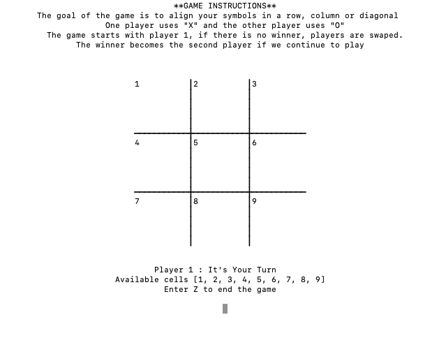

# Demonstration of The Tic-Tac-Toe Game

<!--
*** Thanks for checking out this README Template. If you have a suggestion that would
*** make this better, please fork the repo and create a pull request or simply open
*** an issue with the tag "enhancement".
*** Thanks again! Now go create something AMAZING! :D
-->

<!-- PROJECT SHIELDS -->
<!--
*** I'm using markdown "reference style" links for readability.
*** Reference links are enclosed in brackets [ ] instead of parentheses ( ).
*** See the bottom of this document for the declaration of the reference variables
*** for contributors-url, forks-url, etc. This is an optional, concise syntax you may use.
*** https://www.markdownguide.org/basic-syntax/#reference-style-links
-->

[![Contributors][contributors-shield]][contributors-url]
[![Forks][forks-shield]][forks-url]
[![Stargazers][stars-shield]][stars-url]
[![Issues][issues-shield]][issues-url]

<!-- PROJECT LOGO -->
<br />
<p align="center">
  <a href="https://github.com/ioanniskousis/tic-tac-toe">
    
  </a>
  
  <h3 align="center">Tic-Tac-Toe</h3>
  
  <p align="center">
    This project is part of the Microverse curriculum in Ruby module!
    <br />
    <a href="https://github.com/ioanniskousis/tic-tac-toe"><strong>Explore the docs »</strong></a>
    <br />
    <br />
    <a href="https://repl.it/@ioanniskousis/tic-tac-toe">View Demo</a>
    <a href="https://github.com/ioanniskousis/tic-tac-toe/issues">Report Bug</a>
    <a href="https://github.com/ioanniskousis/tic-tac-toe/issues">Request Feature</a>
  </p>
</p>


<p align="center">
  
</p>

<!-- TABLE OF CONTENTS -->

## Table of Contents

- [About the Project](#about-the-project)
- [Future Features](#future-features)
- [Built With](#built-with)
- [Live Version](#live-version)
- [Acknowledgements](#acknowledgements)
- [License](#license)

<!-- ABOUT THE PROJECT -->

## About The Project

The project consists of four code files

- The 'bin' folder

* main
  The main is the executable file that controls the game logic.

- The 'lib' folder

* game.rb
  This class controls the status of the game. Checking the players moves and deciding the winner if any or if the game is over.

* interface.rb
  This class creates the appearance of the game showing the game board and instructions to users.

* centralizer.rb
  This class is basically a helper class to centralize the output in the center of the screen.

## Future Features
  ### Following version may include
  - Graphical User Interface
  - Alternative images for players choises
  
<!-- ABOUT THE PROJECT -->
## Game Rules
* The game is played by two players.  
* It provides a grid 3 x 3 cells, where each player inserts his/her own symbol, usually X or O.  
* The players insert their symbol in rotation, one after the other; always choosing an empty cell.  
* The player's goal is to align his/her symbol in a row, column or diagonal; this results to a game winner.  
* The game may result to NO WINNER, in case there is no empty cell left and no pattern found.  
* In the case of NO WINNER, the players are swapped.  

In our application, players can continue playing after 'game over' for another round; the winner always plays second after each round.  

## Development
* Clone the project
```
https://github.com/ioanniskousis/tic-tac-toe.git
```
* Run the Application

In order to run the application, just type: `main` and press enter!  

## Testing

In order to run the application, just type: "main" and press enter!

### Built With

This project was built using these technologies.

- Ruby
- Rubocop
- VsCode
- Git-Flow

<!-- LIVE VERSION -->

## Live version

You can see it working [](https://repl.it/@ioanniskousis/tic-tac-toe)

<!-- CONTACT -->

## Contributors

:bust_in_silhouette: **Author_1**
​## Ioannis Kousis

- Github: [@ioanniskousis](https://github.com/ioanniskousis)
- Twitter: [@ioanniskousis](https://twitter.com/ioanniskousis)
- Linkedin: [Ioannis Kousis](https://www.linkedin.com/in/ioannis-kousis-9a5051b4/)
- E-mail: jgkousis@gmail.com

:bust_in_silhouette: **Author_2**
​## Adetayo Sunkanmi

- Github: [@jstloyal](https://github.com/jstloyal)
- Twitter: [@jstloyalty](https://twitter.com/jstloyalty)
- Linkedin: [Adetayo Sunkanmi](https://www.linkedin.com/in/jstloyalty)
- E-mail: jstloyalty@gmail.com

<!-- ACKNOWLEDGEMENTS -->

## Acknowledgements

- [Microverse](https://www.microverse.org/)
- [The Odin Project](https://www.theodinproject.com/)
- [Ruby Documentation](https://www.ruby-lang.org/en/documentation/)

<!-- MARKDOWN LINKS & IMAGES -->
<!-- https://www.markdownguide.org/basic-syntax/#reference-style-links -->

[contributors-shield]: https://img.shields.io/github/contributors/ioanniskousis/tic-tac-toe.svg?style=flat-square
[contributors-url]: https://github.com/ioanniskousis/tic-tac-toe/graphs/contributors
[forks-shield]: https://img.shields.io/github/forks/ioanniskousis/tic-tac-toe.svg?style=flat-square
[forks-url]: https://github.com/ioanniskousis/tic-tac-toe/network/members
[stars-shield]: https://img.shields.io/github/stars/ioanniskousis/tic-tac-toe.svg?style=flat-square
[stars-url]: https://github.com/ioanniskousis/tic-tac-toe/stargazers
[issues-shield]: https://img.shields.io/github/issues/ioanniskousis/tic-tac-toe.svg?style=flat-square
[issues-url]: https://github.com/ioanniskousis/tic-tac-toe/issues

<!-- LICENSE -->

## License

📝
This project is [MIT](https://opensource.org/licenses/MIT) licensed.
